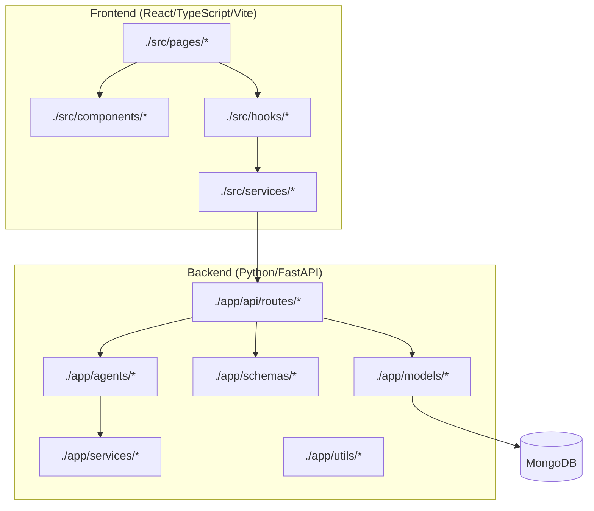
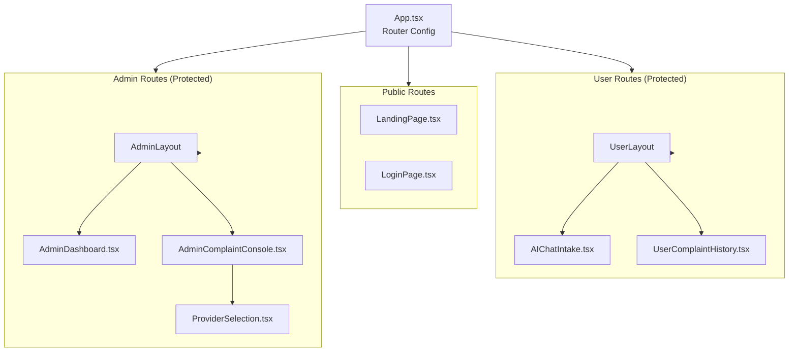
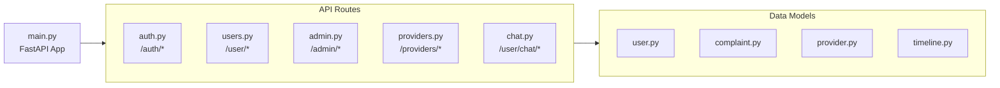
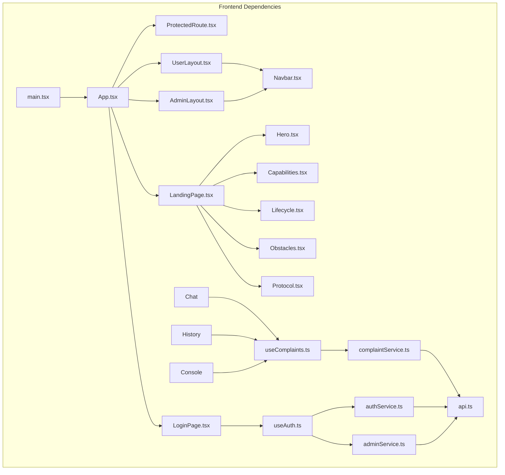
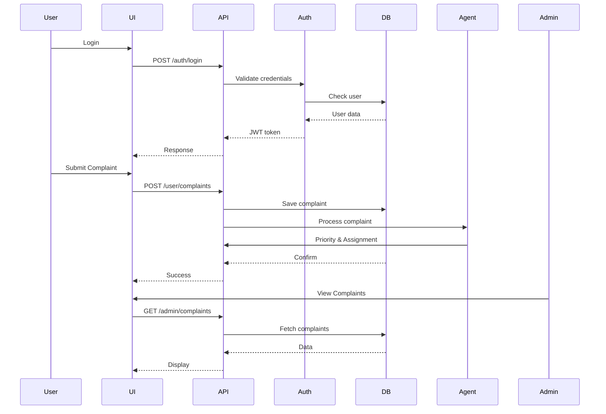
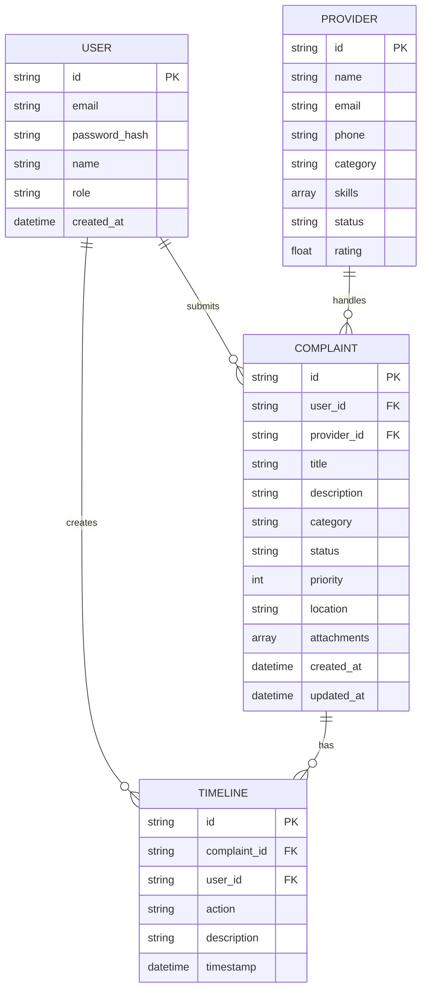

# Code Review Graph - Smart Complaint Management System

> **Note:** The webpaths detailed in this document are incomplete. The correct webpath should be like @[DP-4thSem-main/complaint-management-system/stitch_webpath.txt].

## 1. High-Level Architecture



---

## 2. Frontend Component Hierarchy



---

## 3. Backend API Routes



---

## 4. Agent System (AI Pipeline)

```mermaid
flowchart TB
    Pipeline["pipeline.py<br/>Orchestrator"]

    subgraph Input["Input Understanding Agent"]
        IU1["Parse Complaint Text"]
        IU2["Extract Entities"]
        IU3["Classify Category"]
    end
    
    subgraph Priority["Prioritization Agent"]
        P1["Calculate Urgency Score"]
        P2["Determine Category Priority"]
        P3["Assign Initial Priority"]
    end
    
    subgraph Assignment["Assignment Agent"]
        A1["Find Available Providers"]
        A2["Match Skills to Category"]
        A3["Assign to Provider"]
    end
    
    subgraph LLM["SARVAM LLM"]
        LLM["sarvam_llm.py<br/>AI Processing"]
    end
    
    Pipeline --> Input
    Pipeline --> Priority
    Pipeline --> Assignment

    IU1 --> IU2 --> IU3
    IU3 --> P1 --> P2 --> P3
    P3 --> A1 --> A2 --> A3
    IU3 --> LLM
```

---

## 5. File Dependency Map



---

## 6. Key Service Connections



---

## 7. Database Models



---

## 8. Tech Stack Summary

| Layer | Technology | Files |
|-------|------------|-------|
| **Frontend Framework** | React 18 + TypeScript | `src/main.tsx`, `src/App.tsx` |
| **Build Tool** | Vite | `vite.config.ts` |
| **Routing** | React Router v6 | `App.tsx` |
| **Styling** | Tailwind CSS | `tailwind.config.js`, `src/index.css` |
| **HTTP Client** | Axios | `src/services/api.ts` |
| **Backend Framework** | FastAPI | `backend/app/main.py` |
| **Database** | MongoDB | `backend/app/database.py` |
| **Authentication** | JWT | `backend/app/utils/security.py` |
| **AI Agents** | Custom Python | `backend/app/agents/*` |
| **LLM Integration** | SARVAM API | `backend/app/agents/sarvam_llm.py` |

---

## 9. Critical Code Paths

### Authentication Flow
```
src/pages/LoginPage.tsx
  → src/hooks/useAuth.ts
    → src/services/authService.ts
      → src/services/api.ts (axios instance)
        → backend/app/api/routes/auth.py
          → backend/app/utils/security.py (JWT)
            → backend/app/models/user.py
```

### Complaint Submission
```
src/pages/AIChatIntake.tsx
  → src/hooks/useComplaints.ts
    → src/services/complaintService.ts
      → backend/app/api/routes/users.py
        → backend/app/models/complaint.py
          → backend/app/agents/* (AI processing)
```

### Admin Dashboard
```
src/pages/AdminDashboard.tsx
  → src/hooks/useComplaints.ts
    → src/services/adminService.ts
      → backend/app/api/routes/admin.py
        → backend/app/models/complaint.py
          → backend/app/models/timeline.py
```